# 组件生命周期（★★★）

## 目标

- 说出组件生命周期对应的钩子函数
- 钩子函数调用的时机

## 概述

意义：组件的生命周期有助于理解组件的运行方式，完成更复杂的组件功能、分析组件错误原因等

组件的生命周期： 组件从被创建到挂载到页面中运行，再到组件不在时卸载的过程

生命周期的每个阶段总是伴随着一些方法调用，这些方法就是生命周期的钩子函数

构造函数的作用：为开发人员在不同阶段操作组件提供了实际

## 1.1 生命周期阶段

演示  一个 

```
<div>
	<h2>数据是:  {count}</h2>
	<button>要+1哦</button>
</div>
```


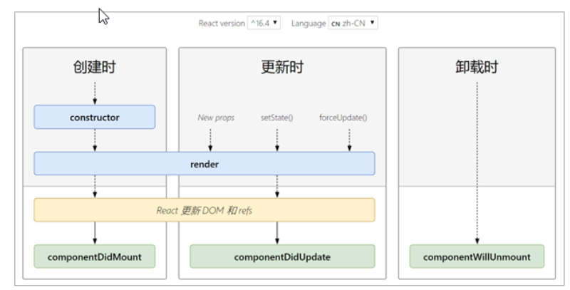

### 创建时（挂载阶段）

- 执行时机：组件创建时（页面加载时）
- 执行顺序


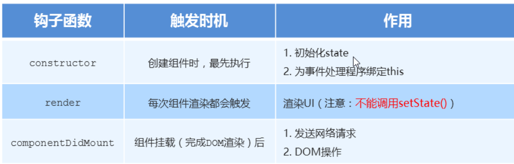

### 更新时

执行时机：`setState()、 forceUpdate()、 组件接收到新的props`

说明：以上三者任意一种变化，组件就会重新渲染

执行顺序：


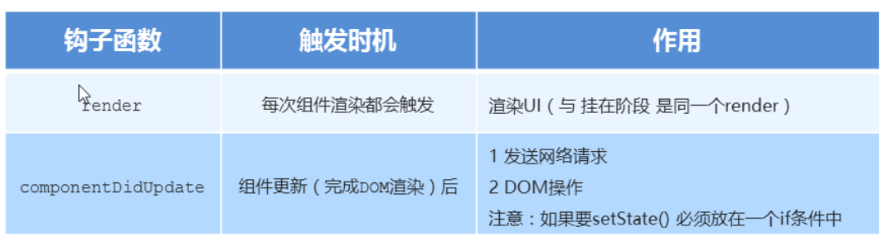

componentDidUpdate(preProps)  preProps 更新之前的老props

### 卸载时

执行时机：组件从页面中消失

作用：用来做清理操作

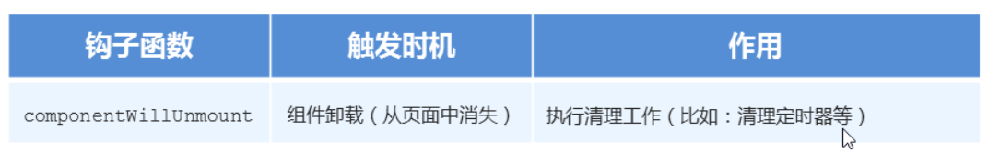

### 1.2 不常用的钩子函数

#### 旧版的生命周期钩子函数

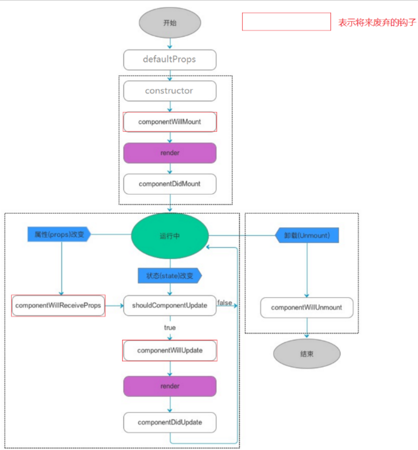

#### 新版完整生命周期钩子函数

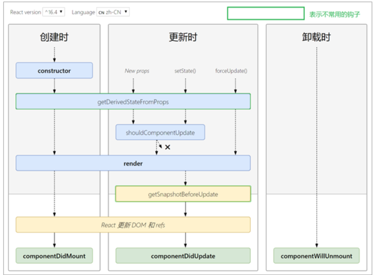

##### `getDerivedStateFromProps()`

- **`getDerivedStateFromProps`** 会在调用 render 方法之前调用，并且在初始挂载及后续更新时都会被调用。它应返回一个对象来更新 state，如果返回 null 则不更新任何内容
- 不管原因是什么，都会在*每次*渲染前触发此方法

##### `shouldComponentUpdate()`

- 根据 **`shouldComponentUpdate()`** 的返回值，判断 React 组件的输出是否受当前 state 或 props 更改的影响。默认行为是 state 每次发生变化组件都会重新渲染
- 当 props 或 state 发生变化时，**`shouldComponentUpdate()`** 会在渲染执行之前被调用。返回值默认为 true

##### `getSnapshotBeforeUpdate()`

- **`getSnapshotBeforeUpdate()`** 在最近一次渲染输出（提交到 DOM 节点）之前调用。它使得组件能在发生更改之前从 DOM 中捕获一些信息（例如，滚动位置）。此生命周期的任何返回值将作为参数传递给 **`componentDidUpdate()`**
- 此用法并不常见，但它可能出现在 UI 处理中，如需要以特殊方式处理滚动位置的聊天线程等

# render-props模式 -就是父传子类似（★★★）

## 目标

- 知道render-props模式有什么作用
- 能够说出render-props的使用步骤

## 2.1 React组件复用概述

- 思考：如果两个组件中的部分功能相似或相同，该如何处理？
- 处理方式：复用相似的功能
- 复用什么？
  - state
  - 操作state的方法
- 两种方式：
  - render props模式
  - 高阶组件（HOC）
- 注意： 这两种方式不是新的API，而是利用React自身特点的编码技巧，演化而成的固定模式

## 思路分析--类似父传子props接收

```
// 比如App只是一个简单的内容 我们所有组件都需要用到一个Mouse公共组件部分
// 有同学肯定会说 我们导入使用就行 对的 这是可以的 现在我们强行讲一个其他方法 -render-props
// 这个render-props我们不一定用  主要是以后大家看见了要知道 不要惊讶

1 先 把APP的内容和Mouse的内容结合起来
2 再思考传参数
// Mouse可以充当公共部分 谁要用就按照这种方式去就行
<Mouse
    //  render=
    >
        {() => (
        <p>
          我是App组件的内容哈哈~~：
        </p>
      )}
 </Mouse>


```


- 思路：将要复用的state和操作state的方法封装到一个组件中

- 如何拿到该组件中复用的state

  - 在使用组件时，添加一个值为函数的prop，通过函数参数来获取

    

- 如何渲染到任意的UI

  - 使用该函数的返回值作为要渲染的UI内容

    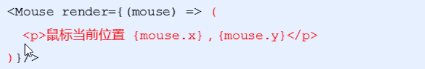

## 使用步骤

- 创建Mouse组件，在组件中提供复用的逻辑代码
- 将要复用的状态作为 props.render(state)方法的参数，暴露到组件外部
- 使用props.render() 的返回值作为要渲染的内容

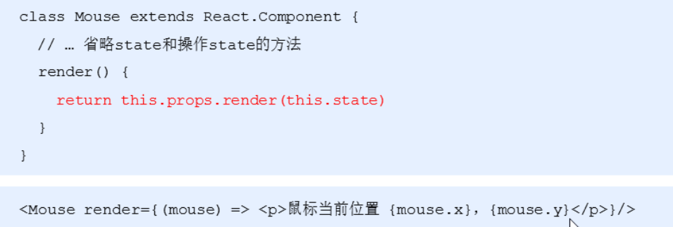

#### 示例demo

```react
class Mouse extends React.Component {
    // 鼠标位置状态
    state = {
        x: 0,
        y: 0
    }

    // 监听鼠标移动事件
    componentDidMount(){
        window.addEventListener('mousemove',this.handleMouseMove)
    }
    handleMouseMove = e => {
        this.setState({
            x: e.clientX,
            y: e.clientY
        })
    }
    render(){
        // 向外界提供当前子组件里面的数据
        return this.props.render(this.state)
    }
}
class App extends React.Component {
    render() {
        return (
            <div>
                App
                <Mouse render={mouse => {
                    return <p>X{mouse.x}Y{mouse.y}</p>
                }}/>
            </div>
        )
    }
}
ReactDOM.render(<App />,document.getElementById('root'))
```

## 2.2 children代替render属性

- 注意：并不是该模式叫 render props就必须使用名为render的prop，实际上可以使用任意名称的prop
- 把prop是一个函数并且告诉组件要渲染什么内容的技术叫做： render props模式
- 推荐：使用childre代替render属性

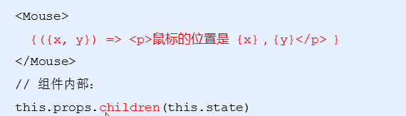

# 高阶组件 （★★★）

## 目标

- 知道高阶组件的作用
- 能够说出高阶的使用步骤

## 概述

- 目的：实现状态逻辑复用
- 采用 包装模式
- 手机：获取保护功能
- 手机壳：提供保护功能
- 高阶组件就相当于手机壳，通过包装组件，增强组件功能


## 3.1 思路分析

- 高阶组件函数 (HOC、Higher-Order Component) 是一个函数，接收要包装的组件，返回增强后的组件


- 高阶组件内部创建了一个类组件，在这个类组件中提供复用的状态逻辑代码，通过prop将复用的状态传递给被包装组件`WrappedComponent`

## 3.2 使用步骤

高阶函数(形式上):如果一个**函数**的形参或者返回值也是**函数**

高阶组件函数:如果一个**函数**的形参和返回值是**组件**

**包装函数**

```react
// 定义一个函数，在函数内部创建一个相应类组件
function abc(WrapComponent){ // 函数组件
     class My extends React.Component{
        componentDidMount(){
            console.log('100----')
        }
        render(){
            return <div>
                <h1>我是My公共部分哦</h1>
            	<WrapComponent/>    // 函数组件
            </div>
        }
    }
    return My
}
// 函数组件
const ComponentA = ()=>{return div}
const ComponentB = ()=>{return div}


const WithA(类组件) = abc(ComponentA)
<WithA/>
const WithB(类组件) = abc(ComponentB)
```

```react

```


## 小结

- 组件通讯是构建React应用必不可少的一环
- props的灵活性让组件更加强大
- 状态提升是React组件的常用模式
- 组件生命周期有助于理解组件的运行过程
- 钩子函数让开发者可以在特定的时机执行某些功能
- `render props` 模式和高阶组件都可以实现组件状态逻辑的复用
- 组件极简模型： `(state,props) => UI`

# 4React原理说明

## 目标

- 能够知道`setState()`更新数据是异步的
- 能够知道JSX语法的转化过程

## `4.1 setState()`说明 （★★★）

### 更新数据-异步的

- `setState()`更新数据是异步的
- 注意：使用该语法，后面的`setState`不要依赖前面`setState`的值
- 多次调用`setState`，只会触发一次render

### 语法1---简单写法

```
this.setState({
  xx:123
})
```


### 语法2 --复杂语法

- ：使用 `setState((state,props) => {})` 语法
- 参数state： 表示最新的state
- 参数props： 表示最新的props

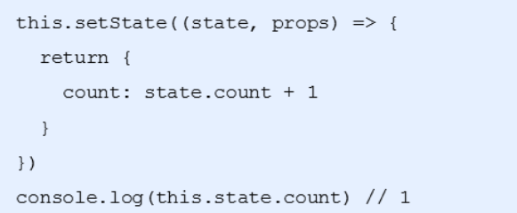


### 注意：第二个参数

- 场景：在状态更新(页面完成重新渲染)后立即执行某个操作
- 语法：`setState(update[,callback])`

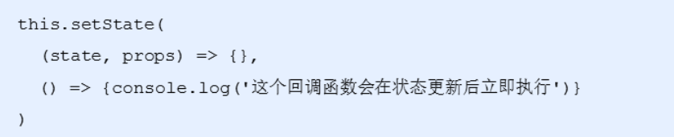

## 4.2 JSX语法的转化过程 （★★★）

- JSX仅仅是`createElement()` 方法的语法糖(简化语法)
- JSX语法被 @babel/preset-react 插件编译为`createElement()` 方法
- React 元素： 是一个对象，用来描述你希望在屏幕上看到的内容

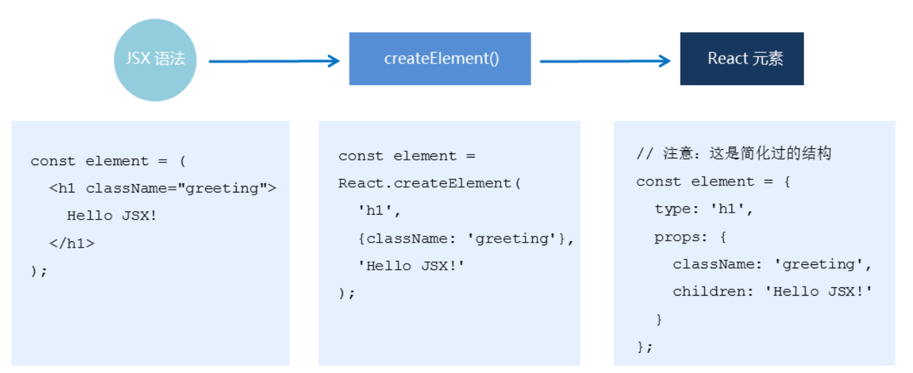

# React原理揭秘

## 目标

- 能够说出React组件的更新机制
- 能够对组件进行性能优化
- 能够说出虚拟DOM和DIff算法

## 1.1 组件更新机制-演示组件更新案例

- setState() 的两个作用
  - 修改state
  - 更新组件

- 过程：父组件重新渲染时，也会重新渲染子组件，但只会渲染当前组件子树（当前组件以其所有子组件）


##### 只要当前父改了 这个父和他所有的子节点都要修改

## 组件性能优化

### 1.2 减轻state

- 减轻state：只存储跟组件渲染相关的数据（比如：count/ 列表数据 /loading等）
- 注意：不用做渲染的数据   固定死的数据   不要放在state中
- 对于这种需要在多个方法中用到的数据，应该放到this中

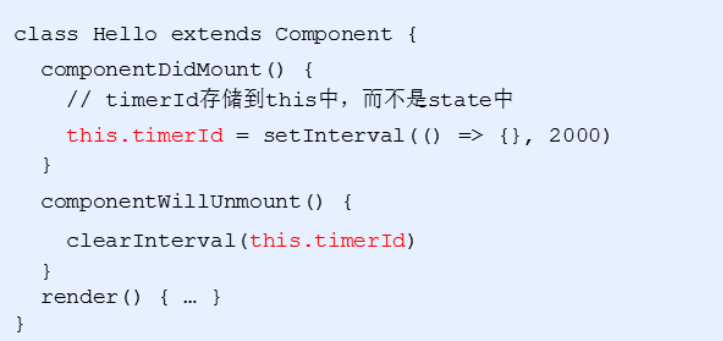

### 1.2 避免不必要的重新渲染

- 组件更新机制：父组件更新会引起子组件也被更新，这种思路很清晰
- 问题：子组件没有任何变化时也会重新渲染
- 如果避免不必要的重新渲染？
- 解决方式：使用钩子函数 shouldComponentUpdate(nextProps, nextState)
  - 在这个函数中，nextProps和nextState是最新的状态以及属性
- 作用：这个函数有返回值，如果返回true，代表需要重新渲染，如果返回false，代表不需要重新渲染
- 触发时机：更新阶段的钩子函数，组件重新渲染前执行(shouldComponentUpdate => render)

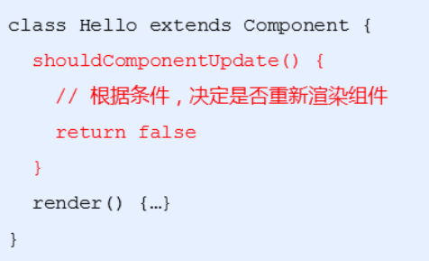

#### 随机数案例

需求：随机生成数字，显示在页面，如果生成的数字与当前显示的数字相同，那么就不需要更新UI，反之更新UI。

利用nextState参数来判断当前组件是否需要更新

```react
class App extends React.Component {
    state = {
        number: 0
    }
    // 点击事件，每次点击生成一个随机数
    hanldeBtn = () => {
        this.setState({
            number: Math.floor(Math.random() * 3)
        })
    }
    // 将要更新UI的时候会执行这个钩子函数
    shouldComponentUpdate(nextProps,nextState) {
         // 判断一下当前生成的 值是否与页面的值相等
         if(nextState.number !== this.state.number){
             return true
         }
         return false
    }
    render() {
        return (
            <div>
                随机数：{this.state.number} <br />
                <button onClick={this.hanldeBtn}>生成随机数</button>
            </div>
        )
    }
}
```

利用props参数来判断是否需要进行更新

```react
class App extends React.Component {
    state = {
        number: 0
    }
    // 点击事件，每次点击生成一个随机数
    hanldeBtn = () => {
        this.setState({
            number: Math.floor(Math.random() * 3)
        })
    }

    render() {
        return (
            <div>
                <NumberBox number={this.state.number} />
                <button onClick={this.hanldeBtn}>生成随机数</button>
            </div>
        )
    }
}
class NumberBox extends React.Component {
    // 将要更新UI的时候会执行这个钩子函数
    shouldComponentUpdate(nextProps, nextState) {
        // 判断一下当前生成的 值是否与页面的值相等
        if (nextProps.number !== this.props.number) {
            return true
        }
        return false
    }
    render() {
        return (
            <h1>随机数：{this.props.number} </h1>
        )
    }
}
```

### 1.3 纯组件

#### 作用以及使用

- 纯组件： PureComponent 与 React.Component 功能相似
- 区别： PureComponent 内部自动实现了 shouldComponentUpdate钩子，不需要手动比较
- 原理：纯组件内部通过分别比对前后两次 props和state的值，来决定是否重新渲染组件


#### 实现原理

- 说明：纯组件内部的对比是 shallow compare（浅层对比）
- 对于值类型来说：比较两个值是否相同


- 引用类型：只比对对象的引用地址是否相同


- 注意：state 或 props 中属性值为引用类型时，应该创建新数据，不要直接修改原数据


```
组件性能优化：
  1   数据 写死了 写完就没改 最好不要写再state
  2   应该再shouldComponentUpdate里面 自己手动写代码 判断是否需要更新
  3   如果只想简单的判断 可以写React.PureComponent 代替 React.Component
```


##建议数组和对象 创建新数据再赋值

## 2 虚拟DOM和Diff算法

- React更新视图的思想是：只要state变化就重新渲染视图
- 特点：思路非常清晰
- 问题：组件中只有一个DOM元素需要更新时，也得把整个组件的内容重新渲染吗？ 不是这样的
- 理想状态：部分更新，只更新变化的地方
- React运用的核心点就是 虚拟DOM 配合 Diff 算法

### 虚拟DOM--控制台查看打印的el

本质上就是一个JS对象，用来描述你希望在屏幕上看到的内容


### Diff算法

执行过程

- 初次渲染时，React会根据初始化的state（model），创建一个虚拟DOM对象（树）
- 根据虚拟DOM生成真正的DOM，渲染到页面
- 当数据变化后(setState())，会重新根据新的数据，创建新的虚拟DOM对象（树）
- 与上一次得到的虚拟DOM对象，使用Diff算法比对（找不同），得到需要更新的内容
- 最终，React只将变化的内容更新（patch）到DOM中，重新渲染到页面


### 代码演示

- 组件render()调用后，根据状态和JSX结构生成虚拟DOM对象(render()方法的调用并不意味着浏览器进行渲染，render方法调用时意味着Diff算法开始比对了)
- 示例中，只更新p元素的文本节点内容
- 初次渲染的DOM对象


- 数据更新之后的虚拟DOM对象


## 小结

- 工作角度：应用第一，原理第二
- 原理有助于更好的理解React的自身运行机制
- setState() 异步更新数据
- 父组件更新导致子组件更新，纯组件提升性能
- 思路清晰简单为前提，虚拟DOM和Diff保效率（渲染变化的组件）
- 虚拟DOM -> state + JSX
- 虚拟DOM最大的特点是 脱离了浏览器的束缚，也就是意味着只要是能支持js的地方都可以用到react，所以为什么说react是可以进行跨平台的开发